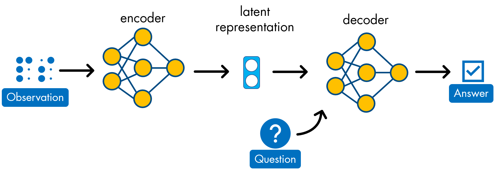
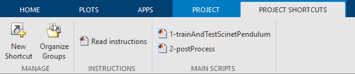

# Discovering physical concepts with neural networks (SciNet) 

In this repository, we implemented and trained the SciNet network described in: [Iten, R., Metger, T., Wilming, H., Rio, L., & Renner, R. (2020). Discovering Physical Concepts with Neural Networks. Phys. Rev. Lett., 124, 010508.](https://journals.aps.org/prl/abstract/10.1103/PhysRevLett.124.010508)
[[arXiv:1807.10300v3](https://arxiv.org/abs/1807.10300v3)].
SciNet attempts to formalize a simplified view of physical modelling thinking process and translate it into a neural network architecture.

Unlike other deep-learning approaches to the description of physical systems, in addition to the 
input-output mapping SciNet automatically provides information on the number of independent underlying physical parameters given
the data at hand.

The network architecture is that of modified variational autoencoder that allows the user to provide
data and ask questions about the physical problem at hand.
The code provided allows the user to train a deep neural network on time series describing the damped 
oscillations of a linear oscillator. Training is performed by providing to the network:
- A set of observations of the oscillator positions for different values of the key physical parameters (namely, the damping and stiffness coefficients)
- A set of questions, i.e. the time instant at which the amplitude of the oscillation should be predicted
- A corresponding set of answers, i.e. the actual values of the amplitude

Once trained, the network is used as follows:
- A time series for the same oscillator is provided as an input to the encoder, to compute the latent space variables 
- A question is fed to the decoder, together with these latent variables, to predict the answer

## Setup
The repository contains MATLAB® implementation code as well as MATLAB trained models. 
The demo is implemented as a MATLAB project. The project will manage all paths and shortcuts you need.
To Run:
1. Open the MATLAB project Scinet.prj
2. (optional) run "Read instructions" from project shortcuts panel

### MathWorks Products (http://www.mathworks.com)

Requires MATLAB release R2019b or newer
- [Deep Learning Toolbox™](https://www.mathworks.com/products/deep-learning.html)

## Getting Started 
- Run "1-trainAndTestScinetPendulum" from project shortcuts panel or use trainAndTestScinetPendulum.mlx livescript to train and test the SciNet network for a damped linear oscillator. 
- Run "2-postProcess" from project shortcuts panel or use the livescript postProcess.mlx to load trainings results, test the model prediction on new data and compare the latent neuron activations with the findings of the paper (https://arxiv.org/abs/1807.10300v3) (page 12).
- Optionally, for a complete list of all files and additional instructions you can run "Read instructions" from project shortcuts panel or open Instructions.mlx livescript.

## License
The license for Discovering physical concepts with neural networks is available in the LICENSE.txt file in this GitHub repository.

## Community Support
[MATLAB Central](https://www.mathworks.com/matlabcentral)

Copyright 2021 The MathWorks, Inc.
